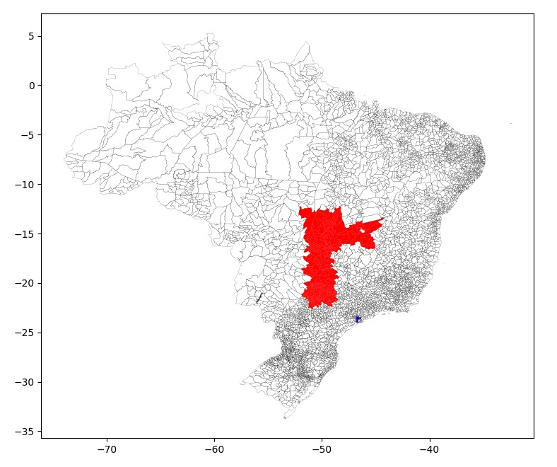

# Pymap-same-population

This tool finds a region around center-city with similar population and shape as another city.

# Usage

Installing the requirements and running the program is pretty straight-forward

## (Optional) Setup venv

You can setup a venv environment to run this repository
`python -m venv venv`
Then to access the virtual environment
`source venv/bin/activate`

## Install requirements
`pip install -r requirements.txt`

## Run the program

The CLI is simple:

`python main.py UF-city_base UF-city_centroid`

Where available UF-city are listed in the `files/fontes/Lista_Municípios_com_IBGE_Brasil_Versao_CSV.csv` file.

Then wait a little while (around 10s probably) and a plot should show up!